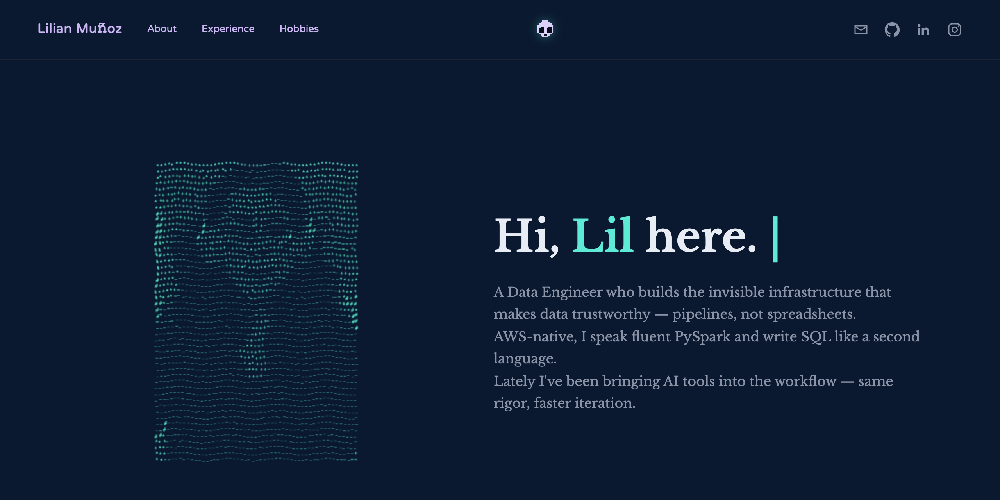

# Lilian Muñoz — Portfolio

Personal portfolio site for **Lilian Muñoz**, Data Engineer. Plain HTML/CSS/JS,
no build step, no framework — deployed straight to GitHub Pages.

**Live:** https://lilianmuzten.github.io/lilmuzten_portfolio/



## Features

- **About / Experience / Hobbies** sections, with a tabbed work-history panel.
- **Interactive ASCII portrait** — the hero photo is sampled into a monospace
  ASCII density ramp on a `<canvas>`, with live mouse/touch physics: nearby
  characters get pushed away from the cursor and ease back into place, adapted to plain JS.
- **Portrait toggle** — the little pixel-art alien button next to the
  portrait crossfades it between the ASCII animation and the real photo in
  exactly 1 second, with the photo scaled to match the ASCII engine's own
  framing so there's no size jump between the two.
- **Wandering nav mascot** — the same pixel-art alien drifts back and forth
  in the nav bar, drawn with plain `fillRect` calls, no image assets.
- A couple of **earlier portrait engines are kept in `script.js`, commented
  out** rather than deleted (a 3-style cycle — monet/digits/princess — and a
  bubble-mosaic engine) — see the file's own comments for why each was
  superseded.

## Project structure

```
.
├── index.html          # all page markup/sections
├── styles.css          # all styling
├── script.js           # nav mascot, ASCII portrait engine + toggle,
│                       # experience tabs, and the deprecated engines
├── assets/             # photos, hobby icons (gifs), favicons
├── favicon.ico / favicon.png
└── apple-touch-icon.png
```

## Running locally

No install, no build step — it's static files. Any local server works, e.g.:

```bash
python3 -m http.server 8000
# then open http://localhost:8000
```

(Opening `index.html` directly as a `file://` URL also works, but a local
server avoids any browser quirks around `fetch`/`Image` loading from disk.)

## Deployment

Pushes to `main` publish directly via GitHub Pages (Settings → Pages →
Deploy from a branch) — no CI workflow, no build step.

## Credits

- Hobby icons: `book.gif`, `horse.gif`, `piano.gif` in `assets/`.

---

© Lilian Muñoz. All rights reserved.
